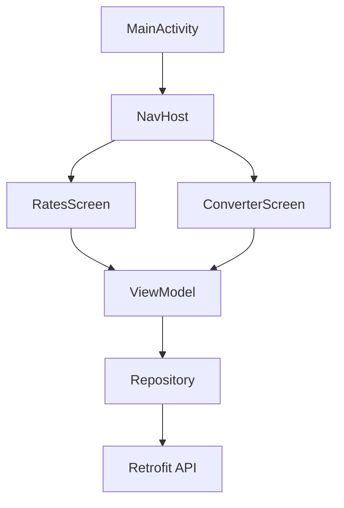

TADAM — Currency Exchange App
----------------------------------------
Purpose
Show live currency rates and convert amounts.

Stack
- Kotlin
- Jetpack Compose
- MVVM
- Retrofit + Coroutines

Arch
UI → ViewModel → Repository → API

Relevant files:
- `MainActivity.kt` — entry point
- `TadamApp.kt` — navigation
- `RatesScreen.kt` — list rates
- `ConverterScreen.kt` — convert UI
- `CurrencyViewModel.kt` — state & logic
- `CurrencyRepository.kt` / `CurrencyApiService.kt` — network

