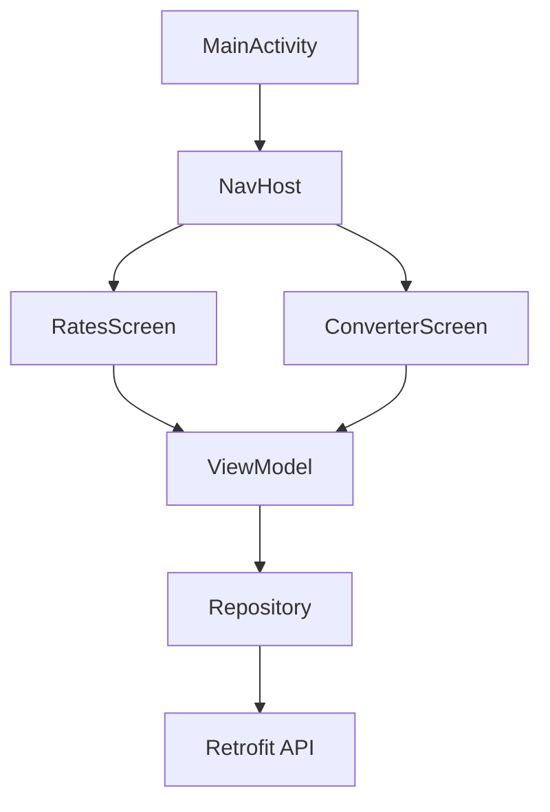

TADAM — Currency Exchange App
----------------------------------------
Purpose
Show live currency rates and convert amounts.

Stack
- Kotlin
- Jetpack Compose
- MVVM
- Retrofit + Coroutines

Arch
UI → ViewModel → Repository → API

Relevant files:
- `MainActivity.kt` — entry point
- `TadamApp.kt` — navigation
- `RatesScreen.kt` — list rates
- `ConverterScreen.kt` — convert UI
- `CurrencyViewModel.kt` — state & logic
- `CurrencyRepository.kt` / `CurrencyApiService.kt` — network




\## Project structure (concise documentation)

This section describes the app structure in a more detailed manner.

- `app/` — Android module containing source code (`src/`), resources (`res/`) and module Gradle settings.
- `build.gradle.kts`, `settings.gradle.kts`, `gradle.properties` — project build configuration.
- `gradlew`, `gradlew.bat`, `gradle/wrapper/` — Gradle wrapper to run builds reproducibly.

Core application code
- `MainActivity.kt` — entry point. Initializes Compose with `setContent` and hosts the app UI.
- `TadamApp.kt` — navigation host and bottom navigation; sets up routes for `RatesScreen` and `ConverterScreen` and shares the `ViewModel`.

UI
- `RatesScreen.kt` — displays exchange rates for a selected base currency and the last update time.
- `ConverterScreen.kt` — UI for converting amounts between two selected currencies; contains input and Convert action.
- `CurrencyDropdown.kt` — reusable composable that shows a list of currency codes and emits the selected value.

Runtime flow (brief)
1. User interacts with a screen (e.g., presses Convert).
2. UI calls a `ViewModel` method.
3. `ViewModel` reads cached rates or calls `Repository` to fetch them.
4. `Repository` performs Retrofit HTTP request and returns `RatesResponse`.
5. `ViewModel` updates its state; Compose recomposes UI to show new data.

6. App fetches live exchange rates from the Frankfurter API (https://api.frankfurter.dev/v2/rates). Responses are JSON objects with base, date and a rates map as such:

Notes & next steps
- Network calls use Kotlin coroutines; UI updates occur on the main thread.
- The project has minimal error handling; recommended improvements: add user-facing error messages and unit/integration tests.

Build & run
```bash
./gradlew assembleDebug
adb install -r app/build/outputs/apk/debug/app-debug.apk
```
